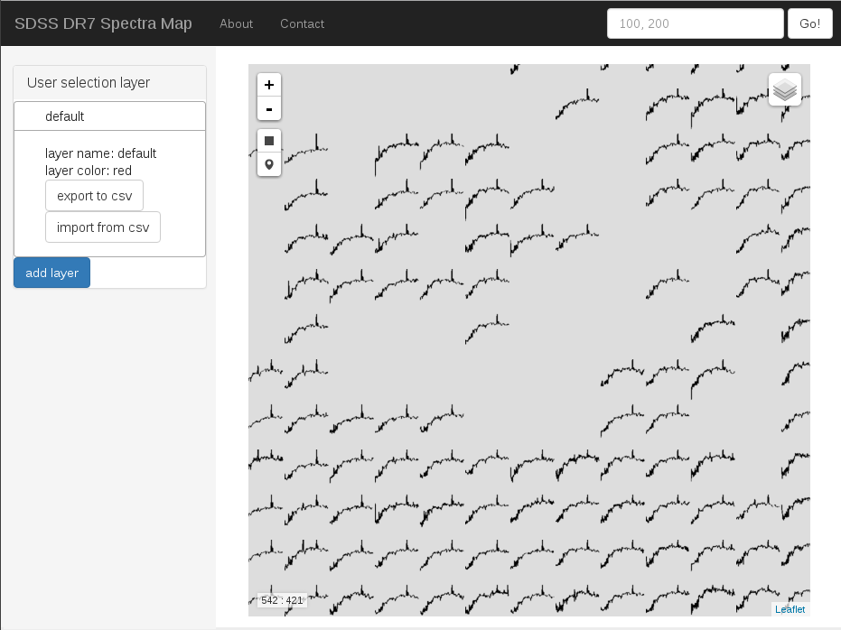

# User Interface documentation

## Map View
The screenshot below shows the most prominent features of the user interface. Most of the screen space is filled by the spectra map. It is composed of icons represenenting downscaled [SDSS](http://sdss3.org) spectra. Left of the map can be found a tool to import and export data sets which would be highlighted in the map. Above the map a tool for coordinate input allows to jump to a certain point in the Kohonen Map.




## Basic use
The user interface is a web application making use of software intended to create responsive streetmaps like for instance [Openstreetmap](http://www.openstreetmap.org). Thus it allows similar interactions. 

### Panning
Use your mouse to pan the map around. To this end click and hold down your left mouse button somewhere on the spectra map and move your mouse. As an Alternative use your keyboards arrow keys to move the map around.
 
 FIXME: Animated gif

### Zooming
There are several ways to zoom in and out of the spectra map. You can click the Plus and Minus buttons on the top left of the spectra area to zoom in and out. Also, turning mousewheel or using your touchpad's scroll function with the mouse cursor over the spectra area will trigger the change of zoom level.
 
 FIXME: Animated gif

### Add and remove Layers
There is a collapsed layer menu on the top right of the spectra area. It allows you to add and remove more layers to the map view. For example you could have a color coded layer for the red shift of your spectra objects.

## Working with the map

### Inspect objects at the SDSS
Clicking on a spectra in the map opens a popup with extra information regarding the clicked object. There can be different data in the popup, however there is at least the link to the [SDSS Explorer](http://skyserver.sdss.org/dr12/en/tools/explore/Summary.aspx?) homepage of the corresponding object. If you are looking for a detailed spectrum and metadata this is the place to go.

  FIXME: Animated gif

### Select objects for later export
On the upper left of the spectra area, below the Plus/Minus zoom control you can find areal and single object selection tools. Use them to make sets of interesting objects for later export or illustration of object positions in the map. 

The objects you select are stored in *user selection layers*. There is alway one such layer named *default*. As soon as you switch it on in the layer control menu in the upper right of the spectra area, you can start to select objects. You will see, that they are indicated with color overlay immediately. 

To export the objects coordinates in the Kohonen Map and the relevant SDSS ids ([MJD](http://www.sdss.org/dr12/help/glossary/#mjd), [plate id](http://www.sdss.org/dr12/help/glossary/#plate), [fiber id](http://www.sdss.org/dr12/help/glossary/#fiber)) click the export button of the according user selection layer left of the spectra area.

Depending on the number of objects in the layer export can take a while. 

An export should look similar to this:

```
som_x,som_y,mjd,plateid,fiberid
16,17,56072,6014,634
16,18,55856,4289,816
16,19,56046,5173,782
16,20,56243,6377,676
17,17,53499,2011,310
17,18,56365,6629,862
17,19,55654,3961,714
17,20,56413,6669,462
18,17,56448,7030,516
18,18,56576,7055,966
18,19,55803,5062,98
18,20,55681,4704,84
19,17,56749,7376,997
19,18,56662,7337,626
19,19,56566,7137,906
19,20,56046,5173,883
```

### Add more user defined layers
You can add more user defined layers. You would want this for example if you need to distinguis between two selections by color or to keep different types of objects apart.

To add a new layer click *add layer* on the left side. You will be asked for a *layer name*, which can be descriptive like *Interesting Objects of Type 1* or short like *other*. Also you can set a color for the indication of selected objects. Use either color words like *red*, *black*, *green* and so on or [html colors in hexadecimal notation](http://www.w3schools.com/html/html_colorvalues.asp). Also, there is a nice [color picker](http://www.w3schools.com/tags/ref_colorpicker.asp) giving you the hexademical values.

Once you have added the new layer, and you probably want to do two things:
1. Add the layer as overlay to the map by activating it in the layer menu in the upper right of the spectra area.
2. Activate the layer as target for selected objects, by clicking it on the left hand side in the list of available layers.

Then start to add objects to the newly created layer by using the selection tools in the upper left of the spectra map.

### Color Overlay
ASPECT-ui allows to import csv-data as layers. Just prepare a [csv](https://en.wikipedia.org/wiki/Comma-separated_values) data set. It has to have headers with at least x and y coordinates in the Kohonen Map space or [MJD](http://www.sdss.org/dr12/help/glossary/#mjd), [plate id](http://www.sdss.org/dr12/help/glossary/#plate), [fiber id](http://www.sdss.org/dr12/help/glossary/#fiber). 

The expected names of the csv fields are `som_x` for the x coordinate in the Kohonen Map, `som_y` for the y coordinate, `mjd` for SDSS MJD, `plateid` for SDSS plate id and `fiberid` for SDSS fiber id.

So your import csv data could look like:

```
som_x,som_y
0,0
100,100
13,234
```

Which would lead to marked objects at the given coordinates. 

If you don't know x and y coordinates but [MJD](http://www.sdss.org/dr12/help/glossary/#mjd), [plate id](http://www.sdss.org/dr12/help/glossary/#plate) and [fiber id](http://www.sdss.org/dr12/help/glossary/#fiber), you can also import data like:

```
mjd,plateid,fiberid
56072,6014,634
55856,4289,816
56046,5173,782
56243,6377,676
```
The software of the user interface will try to map the ids to spectra in the Kohonen Map. They have to be there, of course.

Depending on the number of objects in the layer import can take a while. 
