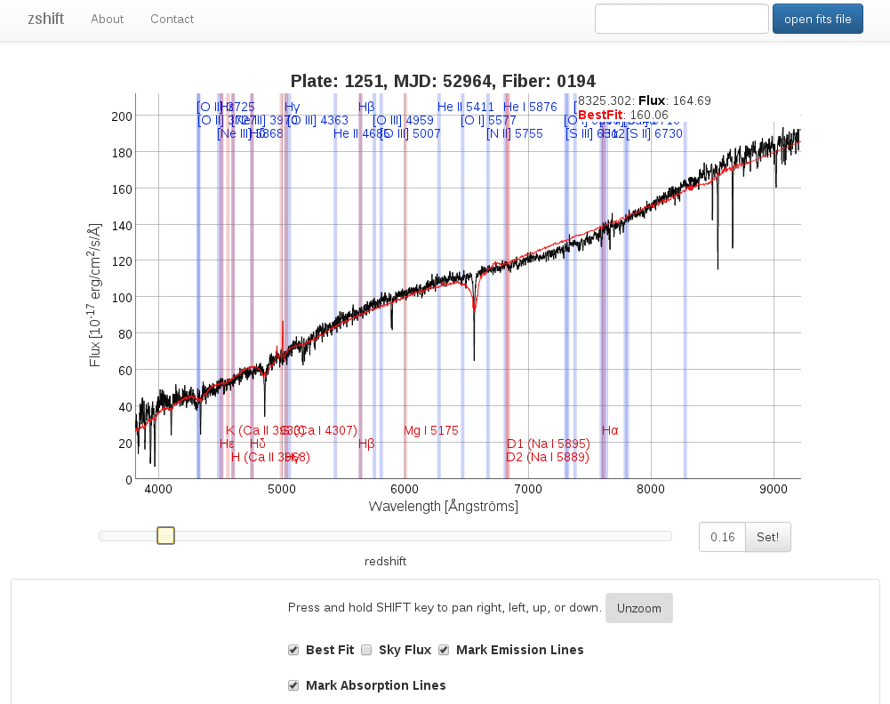

# related tools

## zshift
[zshift](https://aspect-ui.de/zshift/) is a tool to manually determine redshifts of spectra that were faulty redshifted by the [SDSS pipeline](http://www.sdss.org/dr12/spectro/pipeline/).

The tool is mainly inspired by the [interactive spectra view](http://dr12.sdss3.org/spectrumDetail?plateid=1251&mjd=52964&fiber=194) of the [SDSS Sky-Server](http://skyserver.sdss.org/dr12/en/home.aspx) with added functionality for dynamic redshift change and the according redraw of the spectra lines in the background. The changes are commented in the source code of the zshift home page.

### basic use
Click on the button named "open fits file" in the top right corner. Then find your fits file in your file system. Be aware that currently only new spec files from the SDSS (i.e. with names like spec-plateid-mjd-fiberid.fits) can be loaded. Those are the spec files of SDSS DR9 and later. If you want to load older spSpec-files, e.g. from SDSS DR7 and before, you have to find those in the [spectra search](http://dr12.sdss3.org/basicSpectra) using MJD, plate id and fiber id of the spectrum.

After loading the spectrum from your fits file should be plotted. Then start shoving around the slider beneath the plotting area. In the background the spec lines should start to move according to the redshift change.
